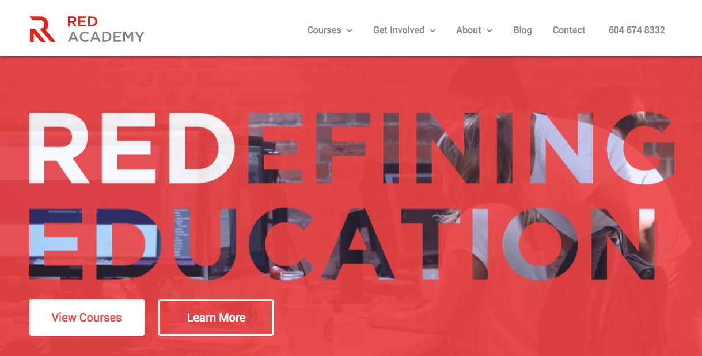
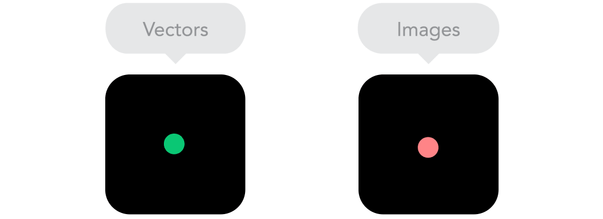
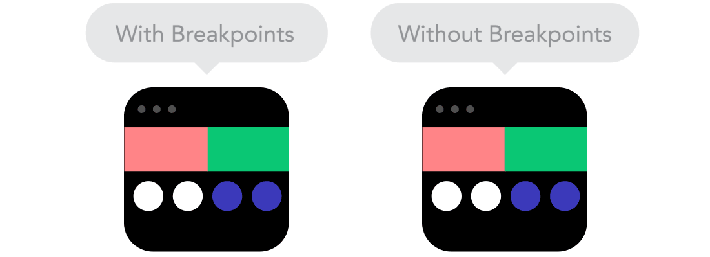
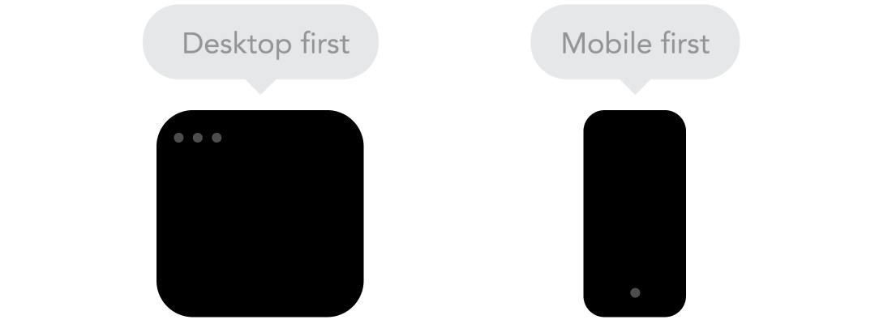

name: inverse
layout: true
class: center, middle, inverse

---

# All About <br />Responsive Web Design

.title-logo[]

---
layout: false

# Agenda

1. HTML/CSS crash course
2. What is "Responsive Web Design"?
3. Flexible layouts and grids
4. Flexible images and media
5. Media queries
6. Mobile first
7. RWD case studies

---
template: inverse

# HTML/CSS Crash Course

---
class: center, middle

.large[
   **HTML** &rarr; the content layer

   **CSS** &rarr; the presentation layer
]

---

# HTML Overview/Review

Virtually all websites share the same basic structure. They contain a `<head>` and a `<body>`, and those two elements are wrapped in `<html>` tags:

```html
<!DOCTYPE html>
<html>
   <head>
      <title>This is the Page Title</title>
   </head>
   <body>
      <p>This is a paragraph.</p>
   </body>
</html>
```

---

# Headings

We've already seen the `<p>` element in action, now let's take a look at headings.

In HTML, you can denote 6 different levels of headings with markup like so:

```html
<h1>Heading 1</h1>
<h2>Heading 2</h2>
<h3>Heading 3</h3>
<h4>Heading 4</h4>
<h5>Heading 5</h5>
<h6>Heading 5</h6>
```

---

# Lists

In HTML we can create both **ordered** and **unordered** lists:

```html
<ol>
   <li>Mix ingredients</li>
   <li>Put cake in oven</li>
</ol>
```

```html
<ul>
   <li>Apples</li>
   <li>Oranges</li>
</ul>
```

---

# Link Elements

Links are the lifeblood of the web, so let's take a look at how we make one:

```html
<p>The <a href="https://developer.mozilla.org/en-US/" target="_blank">
Mozilla Developer Network</a> is a great resource!</p>
```

**Note** that any text contained within the `<a>` tags will be linked to the page inside the quotes of the `href` attribute.

The `target` attribute is typically used to call a new window or tab to open for external links. Internal links don't need the `target` attribute.

---
class: center, middle

.inline-images[
   
]

---

# A CSS Declaration

But you can do a lot more than just change the background color behind some paragraph text:

```css
p {
   color: red;
   font-family: Helvetica, Arial, sans-serif;
   font-style: italic;
   line-height: 1.25;
   margin-bottom: 15px;
}
```

We can also use CSS to **font size**, **background colours**, the **position** of elements in the browser window, and much more.

---

# More on Selectors

We can also target child/descendent selectors:

```css
article p {
   /* your styles here */
}
```

Or multiple selectors at once:

```css
h1, h2, h3 {
   /* your styles here */
}
```

---

# Classes and IDs

Every HTML element can have `class` and `id` attributes added to it like this:

```html
<h1 class="site-title" id="masthead">My Awesome Website</h1>
```

Classes and IDs make it much easier to target specific CSS (and JavaScript) to elements in our HTML.

---

# Classes and IDs

To target an element's class in your CSS, you would use a **dot** plus the **class name**.

To target an element's ID in your CSS, you would use a **pound sign** plus the **ID name**.

```html
<h1 class="site-title" id="masthead">My Awesome Website</h1>
```

```css
.site-title {
   font-weight: bold;
}

#masthead {
   color: red;
}
```

---
template: inverse

# What is Responsive<br />Web Design?

---
class: center, middle

.inline-images-border[
   
]

---
class: center, middle

.inline-images-border[
   
]

---
class: center, middle

### A Definition

Responsive web design involves dynamically adjusting a website's layout and content to work on any screen size, resolution, orientation, or device context.

---
class: center, middle

### RWD &ne; Layout

You need to deal with *visual design* and *interaction design* concerns at the same time.

---
class: center, middle

.large[
   Have you ever tried using a multi-level drop-down nav menu that hadn't been optimized for touch screens while on a smartphone?
]

---
class: center, middle

.inline-images[
   
]

---
class: center, middle

> "Design is not just what it looks like and feels like. Design is how it works."

&mdash;Steve Jobs

---
class: center, middle

.large[
   Jargon alert!
]

---

#Fixed vs. Fluid vs. Adaptive vs. Responsive

**Fixed:** uses set widths and does not scale

**Fluid:** uses percentage-based widths to scale up and down

**Adaptive:** uses media queries to target specific widths, orientations, and devices

**Responsive:** uses fluid grids and media queries, scales up and down accordingly

.footnote[
   *Source: [Team Treehouse](https://teamtreehouse.com/library/build-a-responsive-website/introduction-to-responsive-web-design/fixed-fluid-adaptive-and-responsive-2)*
]

---

# vs. Mobile-Only

- Mobile-only websites are designed specifically to be viewed on mobile devices
- They are not the same the website as the desktop version
- Usually require "browser sniffing" (not foolproof)
- You often find them on "m." sub-domains
- Check out: https://m.facebook.com/
- This is becoming less common today...

---

# Three Elements of RWD

According to Ethan Marcotte, responsively designed websites have these elements in common...

1. Flexible grids and layouts
2. Flexible images and media
3. Media queries

---

# Flexible Grids & Layouts

Flexible grids (and flexible layouts in general) allow us to build websites that dynamically resize to any width:

.center[
   
]

.footnote[
   *Image Credit: [FROONT Open Design Blog](http://blog.froont.com/9-basic-principles-of-responsive-web-design/)*
]

---

# Flexible Images & Media

Flexible images and media compliment layouts by scaling down or up accordingly as the viewport changes size:

.center[
   
]

.footnote[
   *Image Credit: [FROONT Open Design Blog](http://blog.froont.com/9-basic-principles-of-responsive-web-design/)*
]

---

# Flexible Images & Media

Where appropriated, we can also use vector images (in SVG format) to overcome the limitations of scaling up bitmap-format images:

.center[
   
]

.footnote[
   *Image Credit: [FROONT Open Design Blog](http://blog.froont.com/9-basic-principles-of-responsive-web-design/)*
]

---

# Media Queries

Media queries are CSS rules that allow us to target specific styles for different screen sizes, orientations, and resolutions:

.center[
   
]

.footnote[
   *Image Credit: [FROONT Open Design Blog](http://blog.froont.com/9-basic-principles-of-responsive-web-design/)*
]

---
template: inverse

# Flexible Grids & Layouts

---

# Flex It!

Developing flexible grids and layouts require that we let go of the pixel and embrace "relative" units like `em` and `%`.

We have a formula for determining how to size our elements:

.center.large[
   **target &divide; context = result**
]<br />

Where the **target** is the desired width of the element, **context** is the width of the parent element, and the **result** the relative width of the element.

---

# Layout Example

Traditionally, you may have had a page layout like this:

```html
<div class="container">
   <article>This is the content...</article>
   <aside>This is the sidebar...</aside>
</div>
```

```css
.container {
   width: 960px;
}

article {
   width: 640px;
   float: left;
}

aside {
   width: 320px;
   float: right;
}
```

---

# Layout Example

Now, we opt for percentages to make them flexible:

```css
.container {
   width: 100%; /* fill the screen */
}

article {
   width: 66.7%; /* 640px ÷ 960px = 0.667 */
   float: left;
}

aside {
   width: 33.3%; /* 320px ÷ 960px = 0.333 */
   float: right;
}
```
---

# Font Size Example

Similarly, we can achieve the same scaling effect with our font size using `em` units:

```css
body {
   font-size: 16px;
}

h1 {
   font-size: 1.5em; /* 16px * 1.5 = 24px */
}
```

Keep in mind that `em` units change the size of the text relative to the parent element.

---
template: inverse

# Flexible Images & Media

---

# Wrangling Media

Flexible layouts are great, but images and other media require special attention in RWD.

CSS offers some helpers to assist with this wrangling:

- `max-width`
- `min-width`
- `max-height`
- `min-height`

---

# max-width

Using `max-width` is a handy way scale your media:

```css
img, video {
   max-width: 100%; /* adhere to container width */
   height: auto; /* make sure height scales correctly */
}
```

Setting the `max-width: 100%` property will ensure that the element is never larger than it's container.

---

# min-width

Conversely, `min-width` can ensure that a particular element never shrinks below a certain width:

```css
.logo {
   width: 20%; /* scale the logo */
   min-width: 200px; /* but make sure it's at least 200px */
}
```

---

# Exercise 1

Try converting a fixed layout to flexible layout:

<iframe height='268' scrolling='no' src='//codepen.io/redacademy/embed/WvozXj/?height=268&theme-id=0&default-tab=css' frameborder='no' allowtransparency='true' allowfullscreen='true' style='width: 100%;'>See the Pen <a href='http://codepen.io/redacademy/pen/WvozXj/'>WvozXj</a> by RED Academy (<a href='http://codepen.io/redacademy'>@redacademy</a>) on <a href='http://codepen.io'>CodePen</a>.
</iframe>

---
template: inverse

# BREAK TIME!

---
template: inverse

# Media Queries

---

# More on Media Queries

The idea of targeting media for specific devices has been around for a long time.

Even in pre-CSS3 days, we could target styles for different media types using the `media` attribute in a `link` tag:

```html
/* These styles are targeted for display in the browser screen */
<link rel="stylesheet" href="styles.css" media="screen" />

/* These styles customize the page so it works better for print */
<link rel="stylesheet" href="print.css" media="print" />
```

---

# Old Dog, New Tricks

Today, we can take that a step further and target our stylesheets for more specific circumstances:

```html
<link rel="stylesheet" href="styles.css" media="all and (max-width: 960px)">
```

The CSS in this stylesheet will apply to all types of media, but only if they are 960px wide or less.

Currently available media types include `all`, `screen`, `print`, and `speech`.

---

# Old Dog, New Tricks

With media queries today, we can translate this directly into CSS as well:

```html
<!-- In the <head> tag of an .html file... -->

<link rel="stylesheet" href="styles.css" media="all and (max-width: 960px)">
```

```css
/* In a .css file... */

@media all and (max-width: 960px) {
   /* Targeted CSS goes here... */
}
```

Bonus! Putting multiple media queries in one stylesheet saves additional HTTP requests, which is better for site performance.

---

# Media Query Anatomy

The code you stick inside your media query rules works just like any other CSS:

```css
@media screen and (max-width: 960px) {

   body {
      color: red;
   }

}
```

This rule would change the color of the body text to red if the screen is 960px wide or less.

---

# Media Query Anatomy

Also notice the use of the word `and` in the following code.

This is called a **logical operator** and it allows you to specify multiple conditions that must be met in order for the code to be executed:

```css
@media screen and (max-width: 960px) {

}
```

*We'll revisit logical operators again when we learn JavaScript...*

---

# Media Query Anatomy

We can chain more than two conditions together using `and`:

```css
@media screen and (min-width: 480px) and (max-width: 960px) {

}
```

Or comma separate them:

```css
@media screen and (min-width: 480px) and (max-width: 960px),
(min-width: 1200px) {

}
```

---

# Media Query Anatomy

You can specify the screen orientation:

```css
@media screen and (max-width: 960px) and (orientation: landscape) {

}
```

Or target high-density pixel displays, like the Retina screens on Apple devices:

```css
@media (-webkit-min-device-pixel-ratio: 2),
(min-resolution: 192dpi) {

}
```

---

# Choosing Breakpoints

In the earlier days of RWD, people tended to choose breakpoints based on popular device resolutions.

Then this happened...

---

background-image: url(../img/slide-assets/rwd-device-proliferation.jpg)

.footnote.white[
   Image Credit: [Luke Wroblewski](https://www.flickr.com/photos/lukew/10430507184/)
]

---
class: center, middle

### Reductionist approach to breakpoints:

> "Start with the small screen first, then expand until it looks like shit. TIME FOR A BREAKPOINT!"

&mdash;Stephen Hay

---

# Exercise 2

Write your first media query:

<iframe height='268' scrolling='no' src='//codepen.io/redacademy/embed/OVvXWV/?height=268&theme-id=0&default-tab=css' frameborder='no' allowtransparency='true' allowfullscreen='true' style='width: 100%;'>See the Pen <a href='http://codepen.io/redacademy/pen/OVvXWV/'>OVvXWV</a> by RED Academy (<a href='http://codepen.io/redacademy'>@redacademy</a>) on <a href='http://codepen.io'>CodePen</a>.
</iframe>

---
template: inverse

# Mobile First

---

# A Mobile First Approach

Mobile-first means exactly that...start by considering the (smallest) mobile context first:

.center[
   
]

.footnote[
   *Image Credit: [FROONT Open Design Blog](http://blog.froont.com/9-basic-principles-of-responsive-web-design/)*
]

---
class: center, middle


---
class: center, middle


---

# A Mobile First Approach

This means more than simply starting with your smallest breakpoint and building your layouts up from there.

You also need to consider:

- Delivery of appropriately optimized images for a particular screen sizes and resolutions
- Minimizing HTTP requests and page weight to improve page load speed
- What people actually need to see and do with your website on mobile devices!

---

# A Mobile First Approach

There's nothing particularly fancy about writing media queries to be mobile-first. We simply rely predominantly on `min-width` instead of `max-width`:

```css
@media screen and (min-width: 480px) {

}

@media screen and (min-width: 600px) {

}

/* and so on... */
```

Think about mobile-first as being an **additive** rather than **subtractive** approach to web development.

---

# Exercise 3

Time to try out creating media queries for yourself:

<iframe height='268' scrolling='no' src='//codepen.io/redacademy/embed/qdqoKG/?height=268&theme-id=0&default-tab=css' frameborder='no' allowtransparency='true' allowfullscreen='true' style='width: 100%;'>See the Pen <a href='http://codepen.io/redacademy/pen/qdqoKG/'>qdqoKG</a> by RED Academy (<a href='http://codepen.io/redacademy'>@redacademy</a>) on <a href='http://codepen.io'>CodePen</a>.
</iframe>

---
template: inverse

# RWD Case Studies

---
class: center, middle

# [The Boston Globe](http://www.bostonglobe.com/)

---
class: center, middle

# [Smashing Magazine](http://www.smashingmagazine.com/)

---
class: center, middle

# [Squarespace](http://squarespace.com/)

---

# What We've Learned

- The difference between fixed, fluid, adaptive, and responsive websites
- The three things that make a website "responsive"
- How to write media queries
- Why and how to take a mobile-first approach

---
template: inverse

# Questions?

---
class: center, middle

.large[
   RED Academy&#8217;s<br />Web Developer Foundation class starts on July 13!
]
